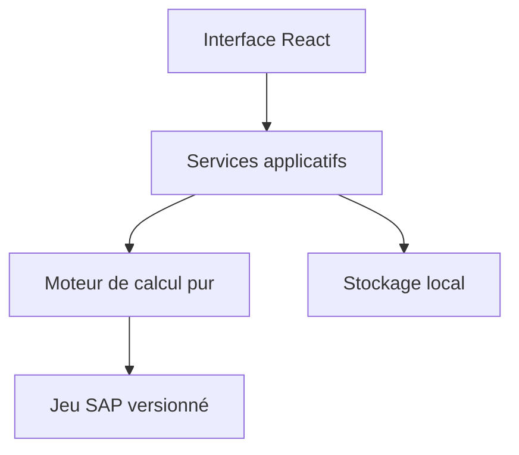

# Architecture proposée

Cette architecture est une proposition à valider après installation des skills techniques.

## Pile

- Tauri 2 : application de bureau et empaquetage ;
- React + TypeScript strict : interface ;
- Rust : commandes Tauri et, si confirmé, moteur de calcul ;
- SQLite : recettes locales et migrations ;
- Playwright : parcours critiques ;
- tests unitaires Rust et TypeScript selon l’emplacement définitif du moteur.

## Frontières



Le moteur pur ne dépend ni de React, ni de Tauri, ni de SQLite.

## Arborescence cible

```text
src/
  components/
  features/
  pages/
  styles/
src-tauri/
  src/
core/
data/
tests/
docs/
packaging/
```

La structure exacte sera créée avec le squelette Tauri ; ne pas ajouter de dossiers vides.

## Principes

- types stricts aux frontières ;
- calculs déterministes et décimaux ;
- données SAP versionnées avec provenance ;
- migrations locales testées ;
- aucune connexion réseau nécessaire ;
- mêmes résultats sous Windows et Ubuntu ;
- CI séparant formatage, lint, tests, build Linux et build Windows.

## Décisions à prendre

1. Emplacement du moteur : Rust ou TypeScript pur.
2. Bibliothèque décimale.
3. Schéma SQLite et stratégie de migrations.
4. Gestion des mises à jour de données hors ligne.
5. MSI, NSIS `.exe`, ou les deux pour Windows.
6. Stratégie de signature des paquets.
